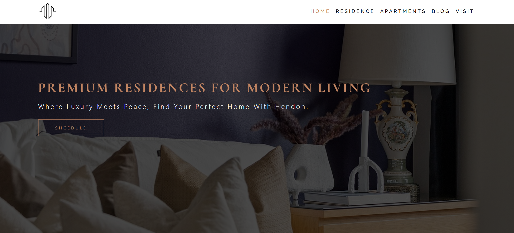

# 🏠 Hendon Real Estate

**Hendon Real Estate** is a modern, responsive website template built using **HTML5, CSS3, and Bootstrap 5**.  
This project is a **frontend recreation for learning and personal use**, inspired by the original Hendon Real Estate design.

---

## 🔍 Overview

This website showcases premium real estate properties with a clean, minimal, and professional layout.  
It demonstrates strong front-end structure and styling using Bootstrap’s grid and utility classes.

---

## 🛠️ Built With

- **HTML5** – Page structure  
- **CSS3** – Custom styling and animations  
- **Bootstrap 5** – Responsive layout and components  
- **Font Awesome** – Icon set  
- **Google Fonts** – Typography  

---

🌟 Features

- Sleek, property-focused layout crafted with Bootstrap 5
- Adaptive design that adjusts beautifully across all screen sizes
- Elegant hero banner to highlight premium listings
- Smooth scrolling navigation and fixed header for easy access
- Polished property cards with subtle hover animations
- Modern sections for showcasing services, agents, and contact info
- Lightweight, fast-loading pages with clean HTML and CSS

---

## 🚀 Live Demo

👉 [View Live](https://mahir9104.github.io/Hendon-Real-Estate/) 

## 💻 Source Code

You can explore the complete source code of this project here:  
👉 [Hendon Real Estate – GitHub Repository](https://github.com/yourusername/Hendon-Real-Estate)

---

## 📸 Preview

---

## 📂 Folder Structure

Hendon-Real-Estate/ 
├─ index.html
├─ style.css 
├─ images/ 
└─ README.md 

---

## 👤 Author 

**Mahir panchal** 
- Frontend Developer | Full-Stack Web Development 
- Learner [GitHub](https://github.com/mahir9104) | [LinkedIn](https://www.linkedin.com/in/mahir-panchal-052232331/)

---

## 📜 Copyright & Disclaimer

© 2025 Mahir. This project is **inspired by the Hendon Real Estate Template** and recreated **for learning and personal use only**.  
Original design rights belong to their respective owners.

---

## 🙌 Acknowledgements

- Inspiration: Hendon Real Estate Template  
- Framework: [Bootstrap 5](https://getbootstrap.com)  
- Icons: [Font Awesome](https://fontawesome.com)  
- Fonts: [Google Fonts](https://fonts.google.com)  

---
